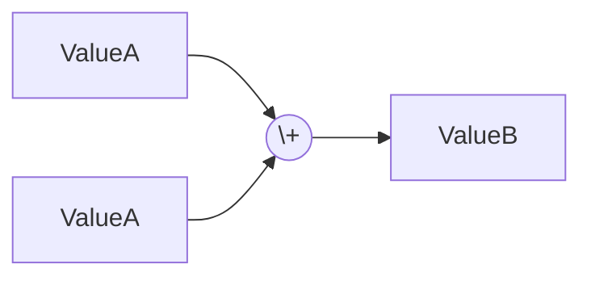
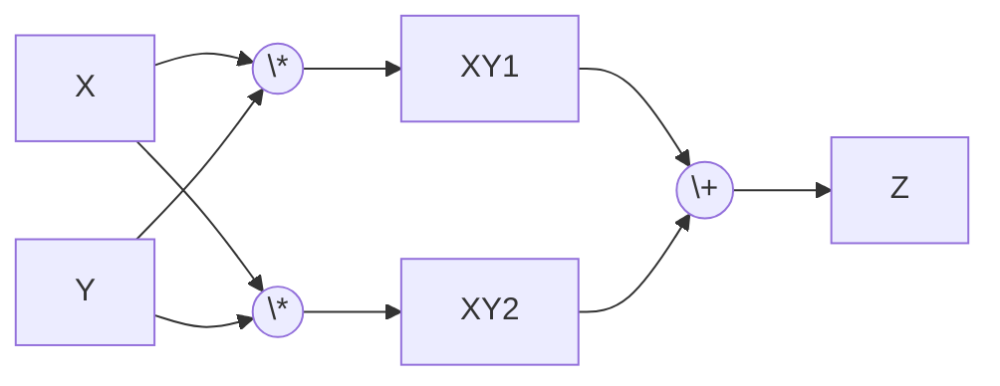

- [GitHub Repository](https://github.com/lalitm1004/oxigrad/tree/autograd)
- [PyPI](https://pypi.python.org/pypi/oxigrad)
 
I've always wanted to understand the math and programming behind a framework like `PyTorch`. So I decided to build one, `oxigrad` will eventually be a tiny ML framework written in Rust with Python bindings.

Today I'm building a scalar-valued autograd engine (I'll eventually add support for tensors and the like).

An autograd engine provides a very useful data structure for calculating the gradients of variables wrt each other.

> Check out Andrej Karpathy's [video](https://www.youtube.com/watch?v=VMj-3S1tku0) on the topic.

## Groundwork

I've decided to represent the `Value` data structure using two things

```rust
pub struct Value(Rc<RefCell<ValueInternal>>);

pub struct ValueInternal {
    pub data: f64,
    pub gradient: f64,
    pub previous: Vec<Value>,
    pub label: Option<String>,
    pub operation: Option<Operation>,
    pub backward: Option<BackwardFn>,
}
```

This choice allows us to easily clone and pass around `Value` structs (called `nodes` from here onwards). Although the `Rc<RefCell>` implementation does make it impossible to multithread (I'll change this in the future).

Add to this the `Operation` enum (which comes in VERY handy later on) and the `BackwardFn` function type that is at the heart of oxigrad.

```rust
pub enum Operation {
    ADD,
    SUBTRACT,
    MULTIPLY,
    DIVIDE,
    POWER(f64),
    EXP

    // Activation Functions
    RELU,
    SIGMOID,

    // Loss Criterion
    CROSSENTROPY(usize),
    MSE(usize),
}

type BackwardFn = fn(value: &Ref<ValueInternal>)
```

> I'll only go over the implementation of `ADD`, `MUL`, and `POWER` in this blog post. You can check out the rest on GitHub

## The forward pass
### Implementation of ADD

```rust
impl Value {
    fn add_ref(&self, other: &Value) -> Value {
        let result = self.borrow().data + other.borrow().data;
  
        let backward: BackwardFn = |out| {
            // drop to prevent multiple mutable references in b = a + a
            let mut first = out.previous[0].borrow_mut();
            first.gradient += out.gradient;
            std::mem::drop(first);
  
            let mut second = out.previous[1].borrow_mut();
            second.gradient += out.gradient;
            std::mem::drop(second);
        };
  
        Value::new_internal(ValueInternal::new(
            result,
            None,
            Some(Operation::ADD),
            vec![self.clone(), other.clone()],
            Some(backward),
        ))
    }
}
```

Nothing too complex, simply calculate the `result` and create a backward function which is then attached to the new node created by the operation. We access the previous node's while backpropagating using the `previous` field of the `ValueInternal` struct.

In backpropagation through an addition operation, each input node’s gradient is incremented by the gradient of the output (child node), since the derivative of addition with respect to each input is 1.

The `std::mem::drop` is called immediately to avoid the following situation.



Here `ValueB.previous` will contain two references of `ValueA` which, when calling the backwards function will cause the thread to panic due to the runtime checks of `RefCell`. Simply dropping them right after their mutable borrow prevents this issue. This problem can arise ANYWHERE there are more than one previous node's involved in an operation.

### Implementation of MUL

```rust
impl Value {
    fn mul_ref(&self, other: &Value) -> Value {
        let result = self.borrow().data * other.borrow().data;
  
        let backward: BackwardFn = |out| {
            let first_data = out.previous[0].borrow().data;
            let second_data = out.previous[1].borrow().data;
  
            // prevent multiple mutable references in b = a * a
            let mut first = out.previous[0].borrow_mut();
            first.gradient += second_data * out.gradient;
            std::mem::drop(first);

            let mut second = out.previous[1].borrow_mut();
            second.gradient += first_data * out.gradient;
            std::mem::drop(second)
        };

        Value::new_internal(ValueInternal::new(
            result,
            None,
            Some(Operation::MULTIPLY),
            vec![self.clone(), other.clone()],
            Some(backward),
        ))
    }
}
```

During backpropagation through a multiplication operation, each input node's gradient is computed by multiplying the gradient of the output (child node) with the value of the other input node. This result is then added to the existing gradient of the input node.

### Implementation of POW

Here lets go over two implementation, my first impl (which did not work) and how i fixed it.

```rust
impl Value {
    fn pow_f64(&self, power: f64) -> Value {
        let result = self.borrow().data.powf(power);

        let backward: BackwardFn = |out| {
            let mut base = out.previous[0].borrow_mut();
            base.gradient += power * base.data.powf(power - 1.0) * out.gradient;
        };

        Value::new_internal(ValueInternal::new(
            result,
            None,
            Some(Operation::POWER),
            vec![self.clone()],
            Some(backward),
        ))
    }
}
```

I really wanted to restrict the power to only be an `f64` type since allowing a `Value` type might give off the wrong idea that it is possible to keep track gradients for all possible combinations of $self^{other}$. (There most probably is I just don't know enough math rn).

The above implementation looks just fine, except for one tiny problem. `backward` captures a variable from the environment, namely `power`. A closure that captures its environment cannot be converted into a function.

There are two ways to fix this, one by converting `BackwardFn` to a `Box<dyn>` type which I don't want to. The methos i chose to fix it is to store the power in the child node and retrieve it later when needed.

We have been doing this all along, we never access `self` and `other` directly but through the child node.

By making tiny changes to the operation struct to allow `POWER` to hold an f64 we can modify the backward function to be the following:

```rust
// snip
let backward: BackwardFn = |out| {
	if let Some(Operation::POWER(power)) = out.operation {
		let mut base = out.previous[0].borrow_mut();

		base.gradient += power * base.data.powf(power - 1.0) * out.gradient;
	};
};

Value::new_internal(ValueInternal::new(
	result,
	None,
	Some(Operation::POWER(power)),
	vec![self.clone()],
	Some(backward),
))
```

I use this pattern a lot when implementing loss functions.

## The backward pass

The forward pass has now been implemented, and so has most of the backward pass. All that is left is to recursively call the backward function stored in the nodes.

This can be easily achieved by creating a topological order.
```rust
impl Value {
	fn backprop_helper(value: &Value) {
        let mut topo_order = Vec::new();
        let mut visited = HashSet::new();
        Self::build_topo_order(value, &mut visited, &mut topo_order);

        for node in topo_order.iter().rev() {
            let temp = node.borrow();
            if let Some(backward) = temp.backward {
                backward(&temp);
            }
        }
    }

    fn build_topo_order(value: &Value, visited: &mut HashSet<Value>, topo_order: &mut Vec<Value>) {
        if visited.contains(value) {
            return;
        }

        visited.insert(value.clone());

        let temp = value.borrow();
        for prev in &temp.previous {
            Self::build_topo_order(prev, visited, topo_order);
        }

        topo_order.push(value.clone());
    }
}
```

I'm not going to explain this code, it's trivial.

What is more important is the Hash implementation of `Value`.

```rust
impl PartialEq for Value {
    fn eq(&self, other: &Self) -> bool {
        Rc::ptr_eq(&self, &other)
    }
}

impl Eq for Value {}

impl Hash for Value {
    fn hash<H: std::hash::Hasher>(&self, state: &mut H) {
        Rc::as_ptr(&self).hash(state);
    }
}
```

Using `Rc::as_ptr` instead of a value-based `Hash`/`Eq` implementation allows us to traverse every possible path



Using a value-based hash implementation would cause incorrect gradients, since both `X` and `Y` occur twice in `Z`'s origin tree. You would end up with only $\frac{1}{2}$ the actual gradient value.

Thus we switch to a pointer based hash impl. This makes it so we don't revisit nodes on a given origin tree twice. `XY1` and `XY2` both hold a reference to the same `X` but those references have different pointer values. Using this approach we get the correct gradients assigned to every node in a graph.

## Conclusion
There we have it. A simple autograd engine implemented in rust. To top it off, we just add `pyo3` as a dependency, write a few wrapper functions, and package it up to be used in Python. I'll write a blog post about training a neural net using oxigrad soon.